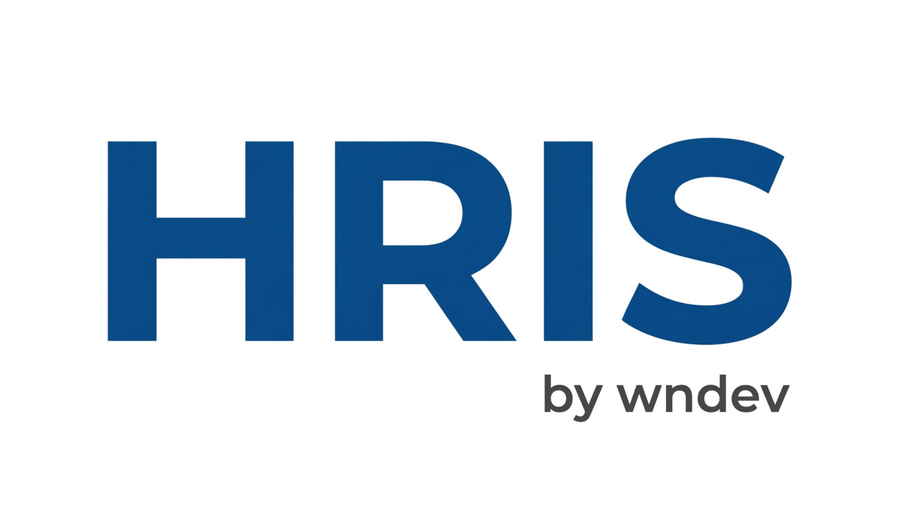

<p align="center">
    
</p>

<p align="center">
    
    
    
    
</p>

<p align="center">
    <a href="#-bahasa-indonesia">Bahasa Indonesia</a> ·
    <a href="#-english">English</a>
</p>

---

## 🇮🇩 Bahasa Indonesia

### Tentang

**HRIS by wndev** adalah sistem presensi dan administrasi karyawan (tanpa modul payroll). Terdiri dari dua aplikasi dalam satu project:

- **Panel admin** (`/panel`) — untuk HRD, admin cabang, dan atasan: monitoring kehadiran, persetujuan pengajuan, KPI, laporan, dan data master.
- **Aplikasi karyawan** (`/`) — tampilan mobile untuk absen dengan foto & lokasi, pengajuan izin/cuti/lembur/dinas, dan pengisian KPI harian.

### Fitur

| Modul | Isi |
| --- | --- |
| **Dashboard** | Ringkasan kehadiran hari ini, antrean persetujuan, kalender aktivitas, karyawan kontrak habis, SP aktif, pengumuman |
| **Data Master** | Karyawan (import/export Excel), jabatan, departemen, cabang & titik lokasi absen, jenis cuti, jam kerja, jadwal kerja departemen, hari libur, pengumuman |
| **Presensi** | Absen masuk/pulang dengan foto & radius lokasi, deteksi lokasi janggal, anulir presensi, jadwal kerja personal |
| **Pengajuan** | Izin, sakit, cuti, roster, izin terlambat, pulang cepat, lembur, dinas luar, kenaikan gaji, BPJS — lengkap dengan alur persetujuan |
| **KPI** | Master KPI per jabatan & departemen, workbook harian, kegiatan tambahan, penilaian atasan, verifikasi HR, laporan performance appraisal |
| **Surat Peringatan** | SP otomatis dari pelanggaran & SP manual, masa berlaku, pemutihan, cetak surat |
| **Laporan** | Laporan presensi per karyawan, rekap presensi, rekap lembur, rekap KPI — cetak & export Excel |
| **Hak akses** | Role & permission per modul (Spatie Permission), pembatasan data per cabang untuk admin cabang |

### Teknologi

| Bagian | Teknologi |
| --- | --- |
| Backend | Laravel 12, PHP 8.2+ |
| Database | PostgreSQL 16+ |
| Panel admin | Tabler 1.4 (Bootstrap 5), jQuery, SweetAlert2, ApexCharts, Leaflet |
| Aplikasi karyawan | Blade + CSS/JS lokal, Vite & Tailwind CSS 4 |
| Hak akses | spatie/laravel-permission |
| Excel | maatwebsite/excel |

### Instalasi

```bash
git clone https://github.com/wahyunugrahha/hris-without-payroll.git
cd hris-without-payroll
composer install
npm install

cp .env.example .env
php artisan key:generate
```

Atur koneksi database di `.env`:

```env
DB_CONNECTION=pgsql
DB_HOST=127.0.0.1
DB_PORT=5432
DB_DATABASE=hris_wndev
DB_USERNAME=postgres
DB_PASSWORD=
```

Lalu siapkan database, storage, dan jalankan aplikasi:

```bash
php artisan migrate --seed
php artisan storage:link
npm run build        # atau: npm run dev
php artisan serve
```

Buka `http://127.0.0.1:8000/panel` untuk panel admin dan `http://127.0.0.1:8000` untuk aplikasi karyawan.

### Akun bawaan (dari seeder)

**Panel admin** — login dengan email di `http://127.0.0.1:8000/panel`:

| Peran | Email | Password | Cakupan data |
| --- | --- | --- | --- |
| Administrator | `admin@wndev.com` | `Admin12345` | Semua cabang |
| HRD | `hrd@wndev.com` | `123456` | Semua cabang |
| HRD | `karina@wndev.com` | `123456` | Semua cabang |
| BOD / Owner | `owner@wndev.com` | `123456` | Semua cabang (lihat saja) |
| HRD Cabang | `hrdketahun@wndev.com` | `123456` | Cabang CBNG0003 |
| HRD Cabang | `hrdjambi@wndev.com` | `123456` | Cabang CBNG0002 |
| HRD Cabang | `hrdsas@wndev.com` | `123456` | Cabang CBNG0004 |
| HRD Cabang | `hrdrbj@wndev.com` | `123456` | Cabang RBJ |

**Aplikasi karyawan** — login dengan NIK di `http://127.0.0.1:8000`:

| NIK | Nama | Password |
| --- | --- | --- |
| `123456` | Akun Testing (Project Manager) | `123456` |

Password bawaan karyawan baru adalah `123456`.

> Ganti password akun bawaan sebelum dipakai di server produksi.

### Data dummy (untuk mencoba)

Mengisi semua fitur dengan contoh data: 30 karyawan (NIK `9000xx`, password `123456`), presensi 30 hari, semua jenis pengajuan, lembur, dinas luar, SP, kenaikan gaji, BPJS, KPI, hari libur, pengumuman, dan titik lokasi.

```bash
php artisan db:seed --class=DummyDataSeeder
```

Aman dijalankan berulang — data dummy lama dihapus dulu, data asli tidak tersentuh. Tidak bisa dijalankan di environment `production`.

**Akun karyawan dummy** — login di aplikasi karyawan dengan NIK berikut, password `123456`:

| NIK | Kondisi untuk dicoba |
| --- | --- |
| `900001` – `900003` | Karyawan baru masuk (kurang dari 3 bulan) |
| `900004` – `900006` | Kontrak habis dalam 45 hari |
| `900007` – `900028` | Karyawan aktif biasa dengan presensi, pengajuan, dan KPI |
| `900029` – `900030` | Sudah keluar (nonaktif), tidak bisa login |

Jabatan karyawan dummy (Staff, Crew Mekanik, Staff HR, Supervisor, Inventory Auditor) dan cabangnya (CBNG0001, CBNG0002, HOJKT01) diacak setiap seeder dijalankan. Nama & jabatan tiap NIK bisa dilihat di menu **Data Karyawan**.

### Tugas terjadwal

Tambahkan cron berikut di server agar tugas harian/bulanan berjalan:

```cron
* * * * * cd /path/ke/project && php artisan schedule:run >> /dev/null 2>&1
```

| Perintah | Jadwal | Fungsi |
| --- | --- | --- |
| `leaderboard:snapshot` | tiap hari 23:51 | Snapshot peringkat kehadiran |
| `leaderboard:snapshot-kpi` | tiap hari 23:52 | Snapshot peringkat KPI |
| `sp:evaluate` | tiap hari 23:53 | Evaluasi & terbitkan surat peringatan otomatis |
| `rekap:bulanan` | tanggal 25, 23:55 | Rekap bulanan kehadiran & KPI |

### Pengujian

```bash
php artisan test
```

### Deploy ke server

```bash
git pull origin main
composer install --no-dev --optimize-autoloader
npm ci && npm run build
php artisan migrate --force
php artisan storage:link
php artisan optimize:clear && php artisan optimize
```

Backup & restore database:

```bash
pg_dump -U postgres -h 127.0.0.1 -p 5432 hris_wndev > backup.sql
psql -U postgres -d hris_wndev -f backup.sql
```

### Catatan

- **Gambar/halaman lama masih tampil:** semua aset memakai versi otomatis (`?v=` waktu ubah file), jadi perubahan langsung terlihat. Bila di browser pernah terpasang service worker aplikasi lain di alamat yang sama, `public/service-worker.js` akan melepasnya sendiri pada kunjungan berikutnya.
- **"Sesi halaman sudah kedaluwarsa":** token form diperbarui otomatis saat halaman lama terbuka. Bila tetap muncul, cukup ulangi aksinya. Lama sesi diatur lewat `SESSION_LIFETIME` (menit) di `.env`.

---

## 🇬🇧 English

### About

**HRIS by wndev** is an attendance and employee administration system (without a payroll module). It ships two applications in one project:

- **Admin panel** (`/panel`) — for HR, branch admins, and supervisors: attendance monitoring, request approvals, KPI, reports, and master data.
- **Employee app** (`/`) — a mobile-first app for photo & location check-in, leave/overtime/business-trip requests, and daily KPI entries.

### Features

| Module | Contents |
| --- | --- |
| **Dashboard** | Today's attendance summary, approval queue, activity calendar, expiring contracts, active warning letters, announcements |
| **Master data** | Employees (Excel import/export), positions, departments, branches & check-in locations, leave types, work shifts, department schedules, holidays, announcements |
| **Attendance** | Check-in/out with photo & location radius, suspicious-location detection, attendance voiding, personal work schedules |
| **Requests** | Permission, sick leave, annual leave, roster, late arrival, early leave, overtime, business trips, salary increase, BPJS — each with an approval flow |
| **KPI** | KPI templates per position & department, daily workbook, extra activities, supervisor assessment, HR verification, performance appraisal report |
| **Warning letters** | Automatic letters from violations & manual letters, validity period, revocation, printable letter |
| **Reports** | Per-employee attendance, attendance recap, overtime recap, KPI recap — print & Excel export |
| **Access control** | Per-module roles & permissions (Spatie Permission), branch-scoped data for branch admins |

### Tech stack

| Part | Technology |
| --- | --- |
| Backend | Laravel 12, PHP 8.2+ |
| Database | PostgreSQL 16+ |
| Admin panel | Tabler 1.4 (Bootstrap 5), jQuery, SweetAlert2, ApexCharts, Leaflet |
| Employee app | Blade + local CSS/JS, Vite & Tailwind CSS 4 |
| Access control | spatie/laravel-permission |
| Excel | maatwebsite/excel |

### Installation

```bash
git clone https://github.com/wahyunugrahha/hris-without-payroll.git
cd hris-without-payroll
composer install
npm install

cp .env.example .env
php artisan key:generate
```

Configure the database connection in `.env`:

```env
DB_CONNECTION=pgsql
DB_HOST=127.0.0.1
DB_PORT=5432
DB_DATABASE=hris_wndev
DB_USERNAME=postgres
DB_PASSWORD=
```

Then prepare the database and storage, and start the app:

```bash
php artisan migrate --seed
php artisan storage:link
npm run build        # or: npm run dev
php artisan serve
```

Open `http://127.0.0.1:8000/panel` for the admin panel and `http://127.0.0.1:8000` for the employee app.

### Default accounts (from the seeder)

**Admin panel** — sign in with email at `http://127.0.0.1:8000/panel`:

| Role | Email | Password | Data scope |
| --- | --- | --- | --- |
| Administrator | `admin@wndev.com` | `Admin12345` | All branches |
| HR | `hrd@wndev.com` | `123456` | All branches |
| HR | `karina@wndev.com` | `123456` | All branches |
| Board / Owner | `owner@wndev.com` | `123456` | All branches (read-only) |
| Branch HR | `hrdketahun@wndev.com` | `123456` | Branch CBNG0003 |
| Branch HR | `hrdjambi@wndev.com` | `123456` | Branch CBNG0002 |
| Branch HR | `hrdsas@wndev.com` | `123456` | Branch CBNG0004 |
| Branch HR | `hrdrbj@wndev.com` | `123456` | Branch RBJ |

**Employee app** — sign in with the employee ID (NIK) at `http://127.0.0.1:8000`:

| NIK | Name | Password |
| --- | --- | --- |
| `123456` | Akun Testing (Project Manager) | `123456` |

The default password for new employees is `123456`.

> Change the default account passwords before using the app in production.

### Dummy data (for trying things out)

Fills every feature with sample data: 30 employees (NIK `9000xx`, password `123456`), 30 days of attendance, every request type, overtime, business trips, warning letters, salary increases, BPJS, KPI, holidays, announcements, and check-in locations.

```bash
php artisan db:seed --class=DummyDataSeeder
```

Safe to run repeatedly — previous dummy data is removed first and real data is left untouched. It refuses to run in the `production` environment.

**Dummy employee accounts** — sign in to the employee app with these NIKs, password `123456`:

| NIK | Scenario to try |
| --- | --- |
| `900001` – `900003` | Newly joined employees (less than 3 months) |
| `900004` – `900006` | Contract ends within 45 days |
| `900007` – `900028` | Regular active employees with attendance, requests, and KPI |
| `900029` – `900030` | Former employees (inactive), cannot sign in |

Dummy employees' positions (Staff, Crew Mekanik, Staff HR, Supervisor, Inventory Auditor) and branches (CBNG0001, CBNG0002, HOJKT01) are randomised on every run. Each NIK's name and position is listed under **Data Karyawan**.

### Scheduled tasks

Add this cron entry on the server so daily/monthly tasks run:

```cron
* * * * * cd /path/to/project && php artisan schedule:run >> /dev/null 2>&1
```

| Command | Schedule | Purpose |
| --- | --- | --- |
| `leaderboard:snapshot` | daily 23:51 | Attendance ranking snapshot |
| `leaderboard:snapshot-kpi` | daily 23:52 | KPI ranking snapshot |
| `sp:evaluate` | daily 23:53 | Evaluate & issue automatic warning letters |
| `rekap:bulanan` | 25th, 23:55 | Monthly attendance & KPI recap |

### Testing

```bash
php artisan test
```

### Deployment

```bash
git pull origin main
composer install --no-dev --optimize-autoloader
npm ci && npm run build
php artisan migrate --force
php artisan storage:link
php artisan optimize:clear && php artisan optimize
```

Database backup & restore:

```bash
pg_dump -U postgres -h 127.0.0.1 -p 5432 hris_wndev > backup.sql
psql -U postgres -d hris_wndev -f backup.sql
```

### Notes

- **Old images/pages still showing:** every asset URL carries an automatic version (`?v=` file modification time), so changes show up immediately. If a service worker from another app was once registered on the same address, `public/service-worker.js` removes it on the next visit.
- **"Page session expired":** form tokens refresh automatically on long-open pages. If the message still appears, simply repeat the action. Session length is set with `SESSION_LIFETIME` (minutes) in `.env`.

---

## License

For internal use. All rights reserved.
